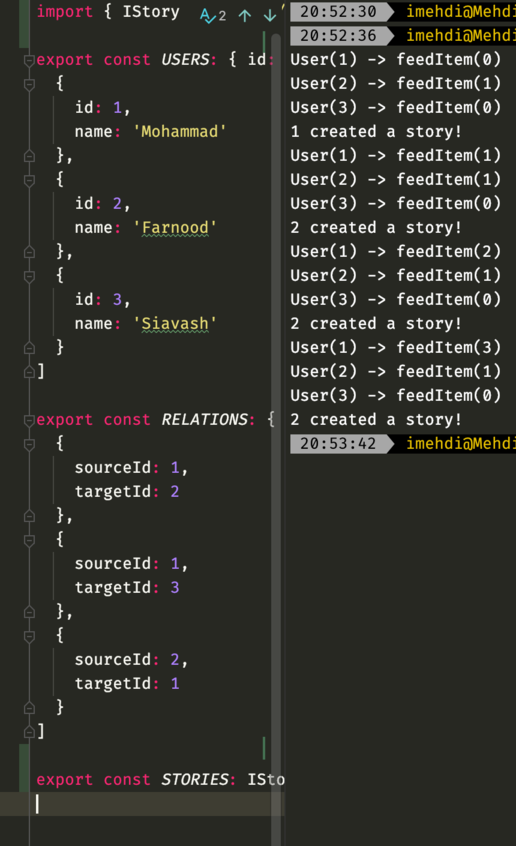

# System design problems

## Instagram
1. Design instagram's story feature.
Instead of fetching stories from database and then prepare feed I want to see feed as a queue and then push story into it! It means that you do not need to find the stories every single time!
I am going to make a separate feed(queue) for each user by using a queue and then when I post a story I am going to find my followers and push my story into their feeds. So everyone has their own ready feed and, It just needs to be fetched.
In one sentence, your feed will be manipulated by people which you are following them.

